# 🚀 3-Tier Java Application on AWS

<p align="center">
  <b>Secure 3-Tier Java Web Application using Nginx, Apache Tomcat and Amazon RDS</b>
</p>

<p align="center">
  
  
  
  
  
</p>

---

## 📌 Project Overview

This project demonstrates how to deploy a **3-Tier Java Web Application on AWS**.

The application is divided into three separate tiers:

1. **Web Tier** – Nginx on a public EC2 instance
2. **Application Tier** – Java application running on Apache Tomcat in a private subnet
3. **Database Tier** – Amazon RDS for MySQL in a private subnet

The user accesses the application through Nginx. Nginx forwards the request to Tomcat, and the Java application connects to RDS using **JDBC**.

---

## 🏗️ Architecture

<p align="center">
  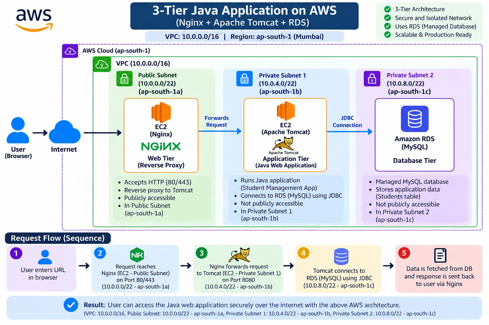
</p>

### AWS Network

| Resource | CIDR | Availability Zone | Role |
|---|---|---|---|
| **VPC** | `10.0.0.0/16` | Mumbai Region | Main AWS network |
| **Public Subnet** | `10.0.0.0/22` | `ap-south-1a` | Nginx / Web Tier |
| **Private Subnet 1** | `10.0.4.0/22` | `ap-south-1b` | Java / Tomcat Application Tier |
| **Private Subnet 2** | `10.0.8.0/22` | `ap-south-1c` | RDS / Database Tier |

> The architecture diagram above shows the complete project flow and the CIDR/AZ details used in this project.

---

## 🔄 Request Flow

```text
User / Browser
      ↓
Internet
      ↓
Nginx EC2
(Public Subnet)
      ↓
Apache Tomcat
(Private Subnet 1)
      ↓
Java Web Application
      ↓
JDBC
      ↓
Amazon RDS MySQL
(Private Subnet 2)
      ↓
Response
      ↓
Nginx
      ↓
User / Browser
```

---

## 🧰 Technologies Used

| Technology | Purpose |
|---|---|
| **AWS VPC** | Creates the isolated network |
| **Public & Private Subnets** | Separates the three application tiers |
| **Internet Gateway** | Provides internet access for the public tier |
| **NAT Gateway** | Provides outbound internet access for private resources |
| **AWS EC2** | Hosts Nginx and Apache Tomcat |
| **Nginx** | Works as a reverse proxy / Web Tier |
| **Java** | Runs the Java web application |
| **Apache Tomcat 9** | Application server for the WAR file |
| **Amazon RDS MySQL** | Managed database |
| **MariaDB Client** | Used to connect to and work with the RDS database |
| **JDBC / MySQL Connector/J** | Connects the Java application to MySQL |
| **SSH** | Secure server access |

---

# ☁️ Project Deployment

## 1️⃣ VPC Resource Map

The AWS VPC was created for the three-tier application. The VPC resource map shows the main networking resources and their relationships.

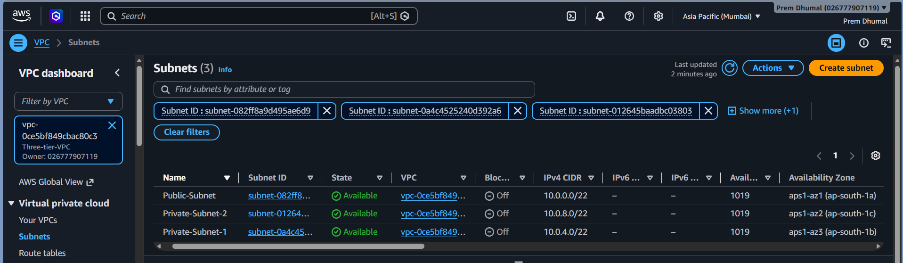

---

## 2️⃣ Subnets, CIDR & Availability Zones

Three subnets were created in different Availability Zones.

- Public Subnet: `10.0.0.0/22` – `ap-south-1a`
- Private Subnet 1: `10.0.4.0/22` – `ap-south-1b`
- Private Subnet 2: `10.0.8.0/22` – `ap-south-1c`

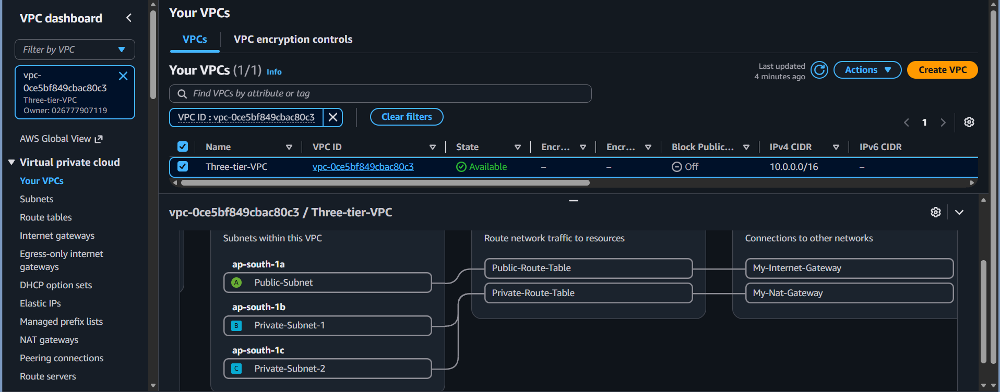

---

## 3️⃣ Three-Tier Security Group

A security group was configured for the project with the required ports:

- **22** – SSH
- **80** – HTTP / Nginx
- **8080** – Tomcat
- **3306** – MySQL

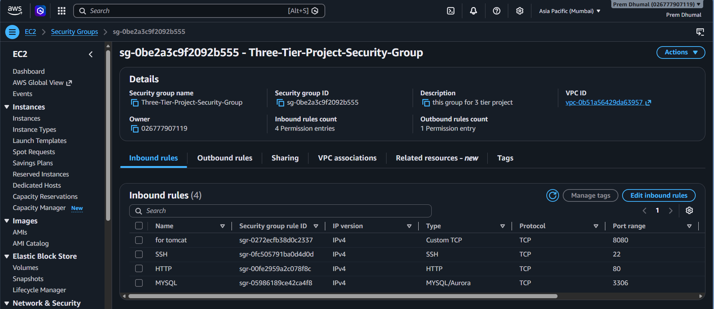

---

## 4️⃣ Proxy Server EC2 Instance

An EC2 instance was launched in the **Public Subnet** to work as the Nginx reverse proxy.

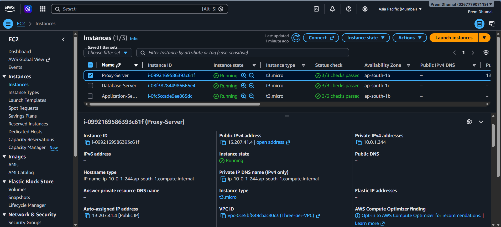

---

## 5️⃣ Application Server EC2 Instance

An EC2 instance was launched in **Private Subnet 1** for the Java application and Apache Tomcat.

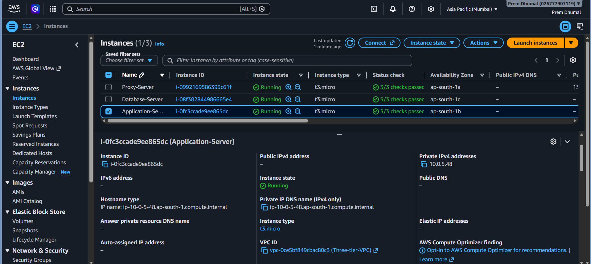

---

## 6️⃣ Database Server EC2 Instance

An EC2 instance was launched in **Private Subnet 2** for database-side access and verification.

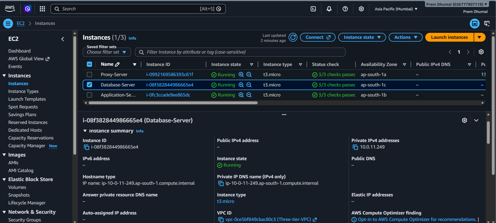

---

## 7️⃣ SSH Agent & Single Key

SSH Agent was configured so the same project key could be used for secure access across the servers.

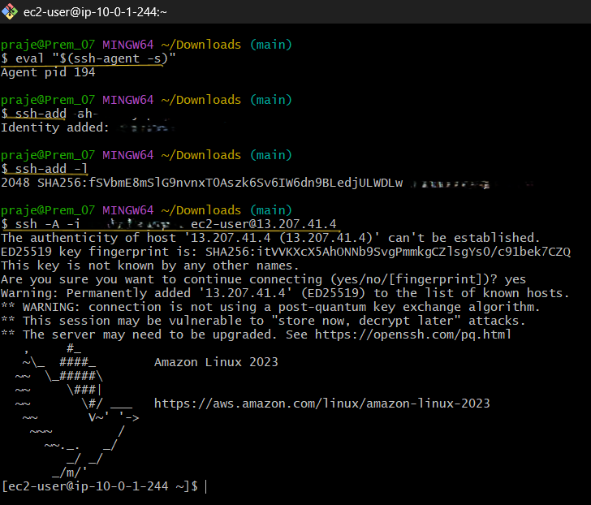

---

## 8️⃣ Hostname & Server Jump

Server hostnames were configured and jump access was performed across the three-tier environment.

```text
Proxy Server → Application Server → Database Server
```

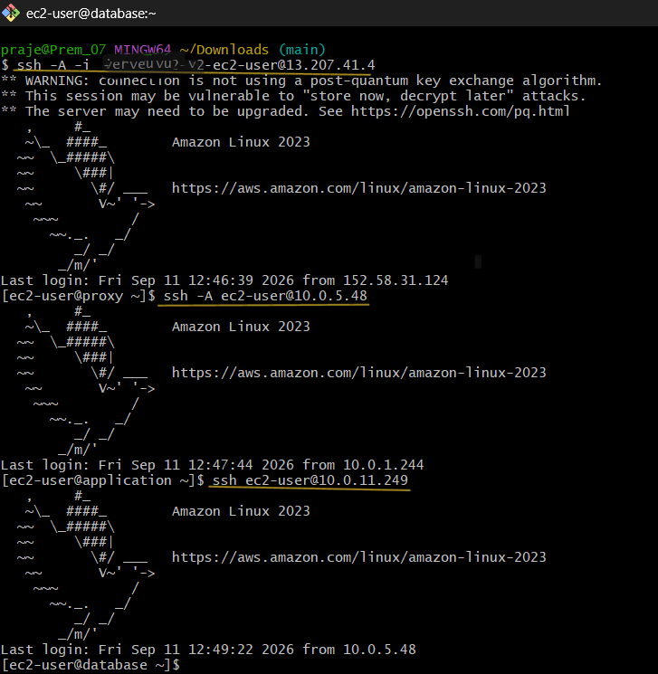

---

## 9️⃣ Nginx Status, Start & Enable

Nginx was installed on the proxy server and the service was checked, started and enabled.

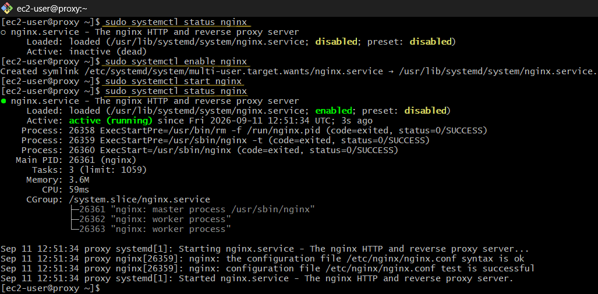

---

## 🔟 Nginx Reverse Proxy Configuration

Nginx was configured to forward requests from the public proxy server to the Tomcat application server on port `8080`.

Example:

```nginx
location / {
    proxy_pass http://<APPLICATION_PRIVATE_IP>:8080;
}
```

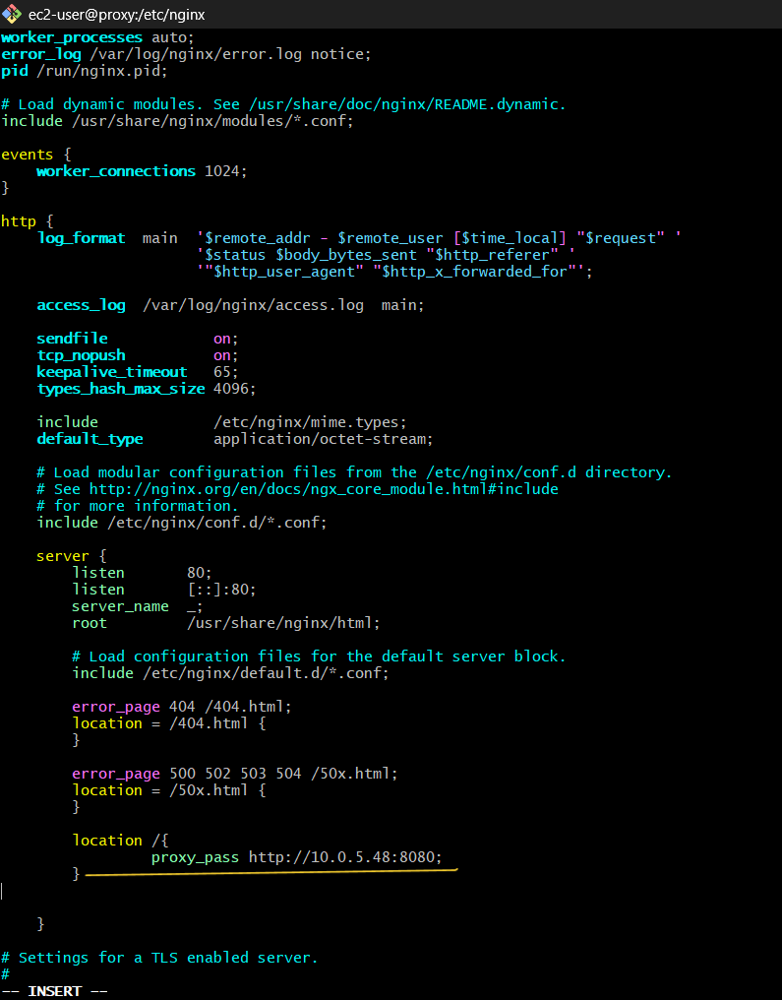

---

## 1️⃣1️⃣ Java & Apache Tomcat Download

Java was verified on the application server and Apache Tomcat 9 was downloaded and extracted into `/opt`.

Example commands:

```bash
java --version
sudo wget <tomcat-download-url>
sudo tar -xvzf apache-tomcat-9.x.x.tar.gz -C /opt
```

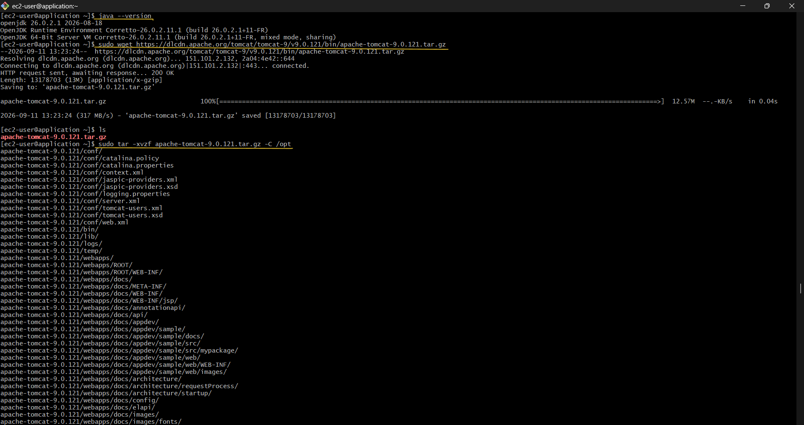

---

## 1️⃣2️⃣ Tomcat Start

The extracted Tomcat directory was renamed to `tomcat`, and Tomcat was started using `catalina.sh`.

```bash
/opt/tomcat/bin/catalina.sh start
```

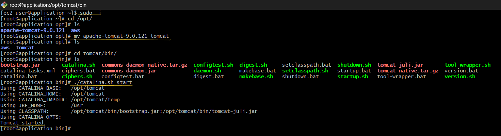

---

## 1️⃣3️⃣ Tomcat Default Page

The Tomcat default page was opened in the browser through the Nginx proxy.

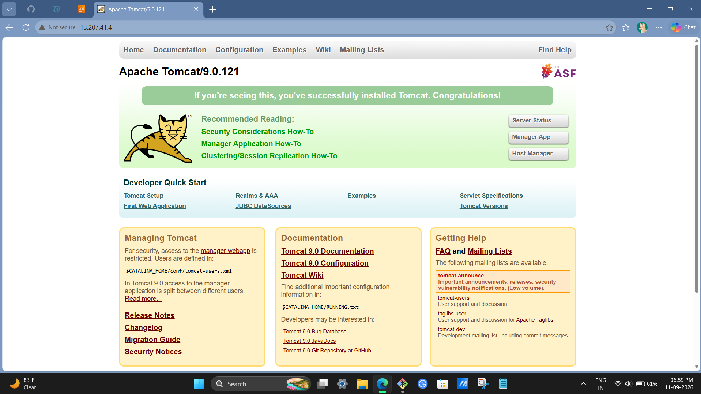

---

## 1️⃣4️⃣ Student WAR Download & Deployment

The developer-provided `student.war` application was downloaded into Tomcat's `webapps` directory.

Example:

```bash
curl -L -o student.war "<student-war-url>"
```

Tomcat was restarted so the WAR application could be deployed.

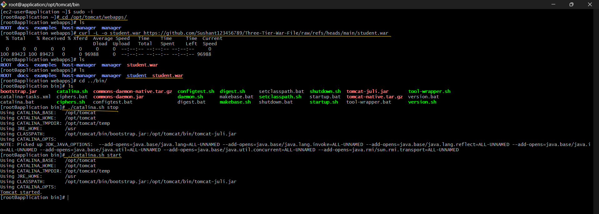

---

## 1️⃣5️⃣ Nginx Student Route Configuration

The Nginx configuration was updated to forward the `/student/` request to the Java application.

Example:

```nginx
location /student/ {
    proxy_pass http://<APPLICATION_PRIVATE_IP>:8080/student/;
}
```

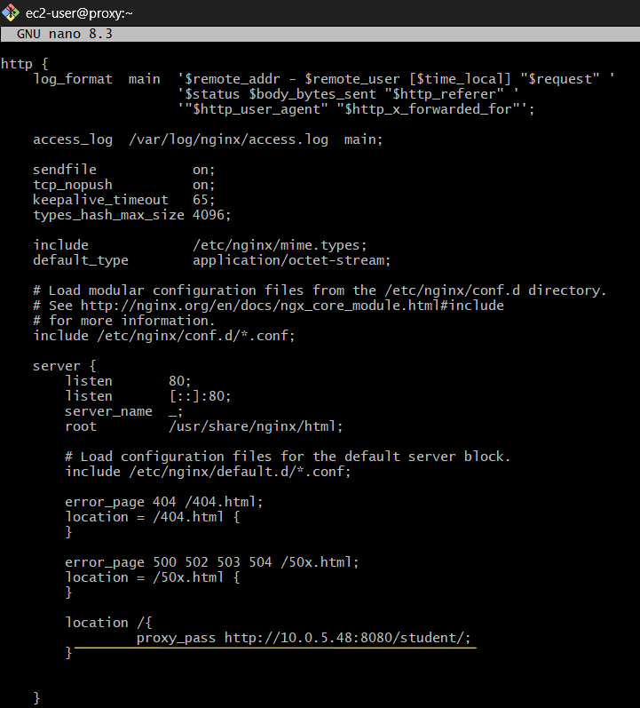

---

## 1️⃣6️⃣ Student Registration Form

The Student Registration Form was successfully displayed through the public Nginx endpoint.

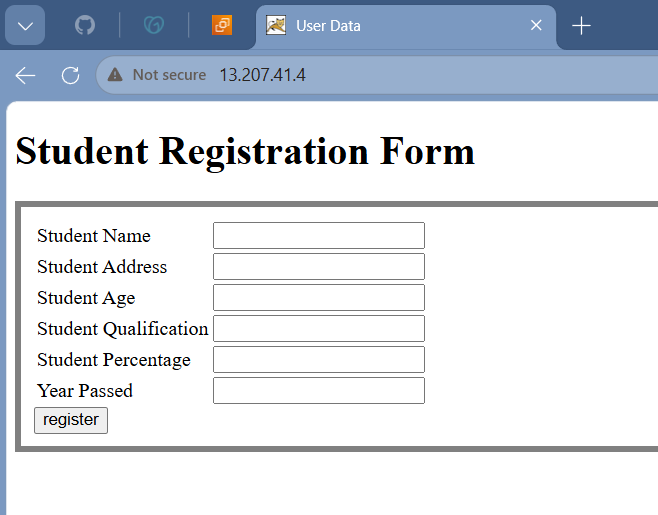

---

## 1️⃣7️⃣ Filled Student Form Before Submit

The student details were entered into the application before submitting the form.

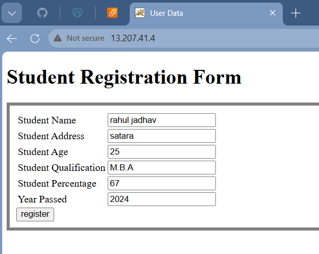

---

# 🛠️ Troubleshooting

## 1️⃣8️⃣ Database Connection Error

When the form was submitted before adding the MySQL JDBC connector and database configuration, the application returned:

```text
Sorry! unable to save record
```

This was used as a troubleshooting point in the project.

**Problem:**  
The Java application could not save the form data because the database connectivity configuration was not completed.

**Solution:**  

1. Create Amazon RDS MySQL.
2. Connect to RDS and prepare the required database/table.
3. Add **MySQL Connector/J** to Tomcat.
4. Configure the RDS connection in `context.xml`.
5. Restart Tomcat and Nginx.
6. Test the application again.

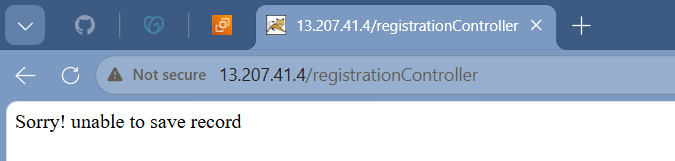

---

## 1️⃣9️⃣ Amazon RDS Created

Amazon RDS for MySQL was created as the managed database used by the application.

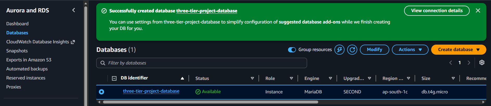

---

## 2️⃣0️⃣ MariaDB, RDS Connection & SQL Queries

MariaDB client tools were verified on the database server.

The server was then used to connect to the RDS MySQL database and run the required SQL queries.

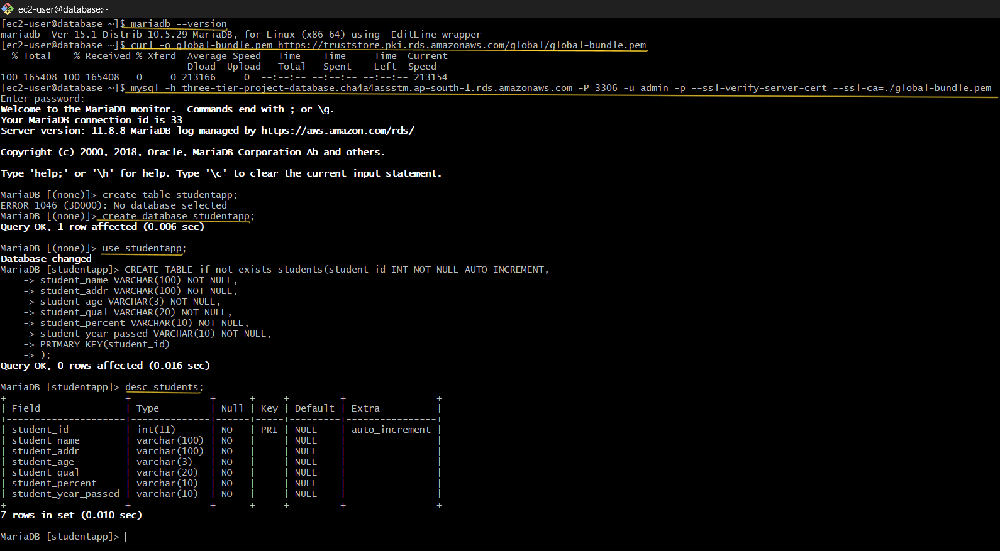

---

## 2️⃣1️⃣ MySQL Connector & Context Configuration

On the application server, the MySQL Connector/J JAR was added to:

```text
/opt/tomcat/lib/
```

The Tomcat configuration directory was also checked before opening `context.xml`.

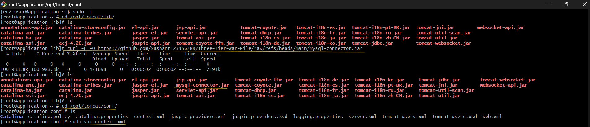

---

## 2️⃣2️⃣ Tomcat Context — RDS Database Configuration

The Tomcat `context.xml` file was configured with the RDS database connection details.

The configuration connects the Java application to the RDS MySQL database through JDBC.

> Database passwords should be kept private and should never be committed to GitHub.

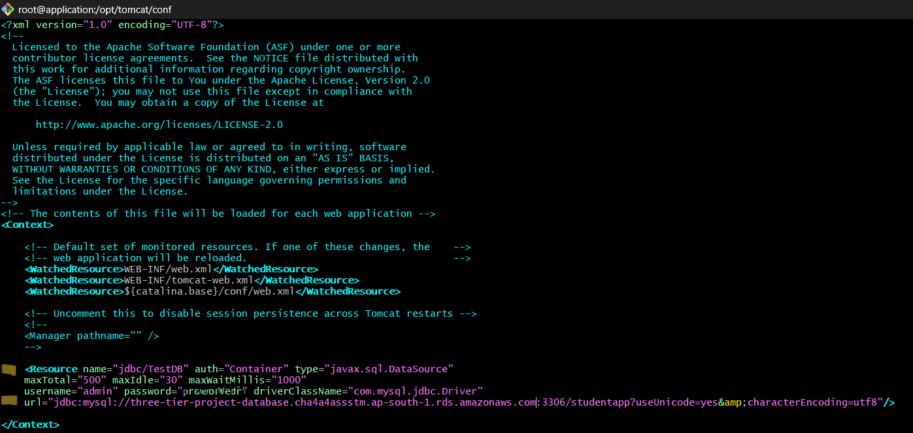

---

## 2️⃣3️⃣ Final Tomcat & Nginx Restart

After completing the database configuration, Tomcat and Nginx were restarted/reloaded.

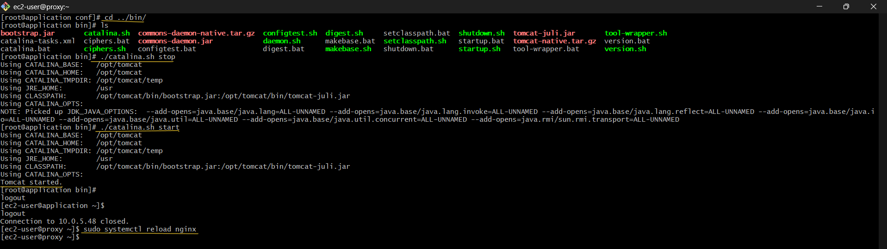

---

## 2️⃣4️⃣ Final Student Form

The Student Registration Form was tested again after completing the database configuration.

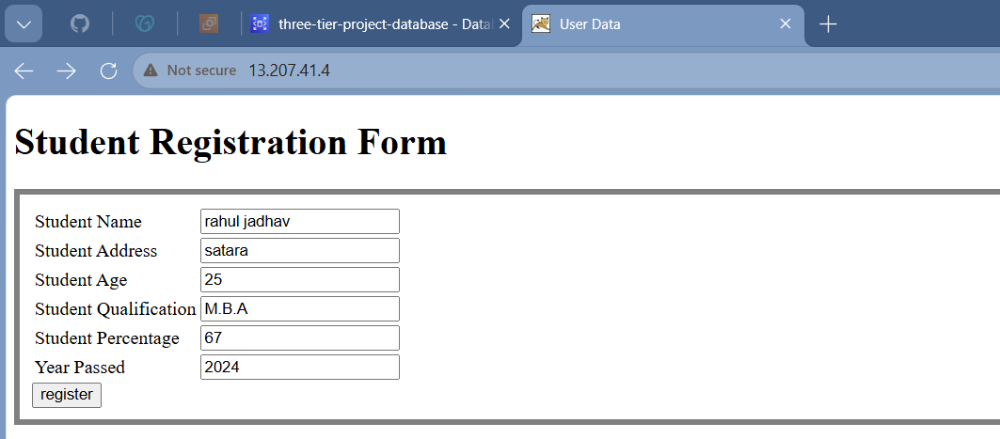

---

## 2️⃣5️⃣ Successful Student List Output

The submitted student information was successfully displayed by the Java application.

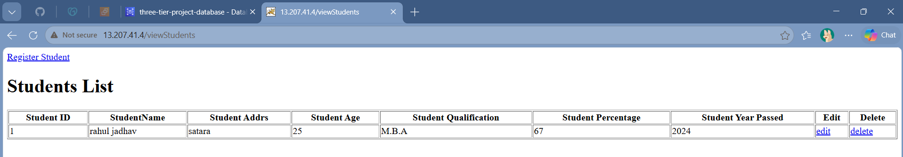

---

## 2️⃣6️⃣ Database Data Verification

The database was checked after the successful submission and the student data was verified.

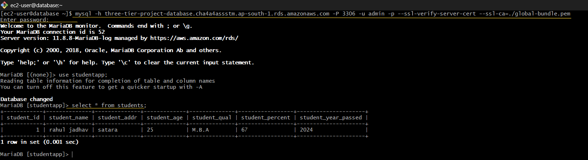

---

# 📂 Project Structure

```text
3-Tier-Project-Java/
│
├── README.md
├── architecture-diagram.png
└── screenshots/
    ├── 01-vpc-resource-map.png
    ├── 02-subnets-cidr-availability-zones.png
    ├── 03-security-group.png
    ├── 04-proxy-server-instance.png
    ├── 05-application-server-instance.png
    ├── 06-database-server-instance.png
    ├── 07-ssh-agent-single-key.png
    ├── 08-hostname-and-server-jump.png
    ├── 09-nginx-status.png
    ├── 10-nginx-reverse-proxy-config.png
    ├── 11-java-tomcat-download-extract.png
    ├── 12-tomcat-start.png
    ├── 13-tomcat-default-page.png
    ├── 14-student-war-download-and-deploy.png
    ├── 15-nginx-student-route-config.png
    ├── 16-student-registration-form.png
    ├── 17-student-form-filled-before-submit.png
    ├── 18-database-connection-error.png
    ├── 19-rds-database-created.png
    ├── 20-mariadb-rds-connection-sql.png
    ├── 21-mysql-connector-download-context-command.png
    ├── 22-context-xml-db-config.png
    ├── 23-final-tomcat-nginx-restart.png
    ├── 24-final-student-form.png
    ├── 25-successful-student-list-output.png
    └── 26-database-data-verification.png
```

---

# 🎯 What I Learned from This Project

This project helped me understand how a real **3-Tier application architecture** works on AWS.

### AWS Networking
- How to create a VPC.
- How to create public and private subnets.
- How CIDR ranges are used.
- How Availability Zones are used.
- How route tables control network traffic.
- Why an Internet Gateway is used for public resources.
- Why a NAT Gateway is used for outbound internet access from private resources.

### AWS Compute
- How to create and configure EC2 instances.
- How to separate Web, Application and Database tiers.
- How to connect to private servers using SSH jump access.

### Web & Application Tier
- How Nginx works as a reverse proxy.
- How Nginx forwards requests to Tomcat.
- How to install Java.
- How to download and configure Apache Tomcat.
- How to deploy a WAR file in Tomcat.
- How to configure an application route such as `/student/`.

### Database & JDBC
- How to create Amazon RDS for MySQL.
- How to connect to RDS using database client tools.
- How to run SQL queries.
- What JDBC is and how it connects a Java application to MySQL.
- How to add MySQL Connector/J to Tomcat.
- How `context.xml` is used for database configuration.

### Troubleshooting
- How to identify a database connection problem from the application output.
- How to troubleshoot a Java application that cannot save data.
- How to add the missing JDBC connector.
- How to update database configuration and restart the required services.
- How to verify the final result from both the application and database.

---

# 🏆 Final Result

The **3-Tier Java Application** was successfully deployed on AWS.

The final architecture provides:

```text
Internet
   ↓
Nginx (Public EC2)
   ↓
Apache Tomcat + Java Application
(Private Subnet 1)
   ↓
JDBC
   ↓
Amazon RDS MySQL
(Private Subnet 2)
```

The student form was successfully submitted, the data was displayed by the application, and the same data was verified in the database.

---

## ⭐ Key Takeaway

> **A 3-Tier architecture separates the Web, Application and Database layers, making the application easier to manage, secure and troubleshoot.**
